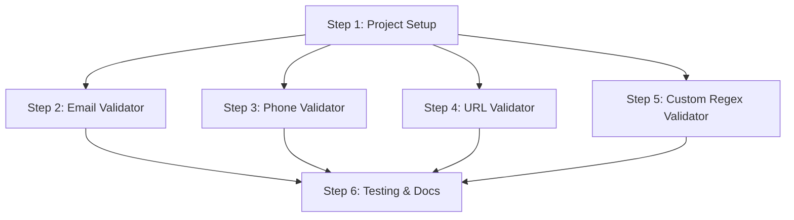

# MCP Validation Server - Master Implementation Plan

## Project Overview
Building a modular MCP server in Python for input validation with 4 validators: Email, Phone, URL, and Custom Regex.

## Architecture Diagram
[View Architecture Diagram](https://www.figma.com/online-whiteboard/create-diagram/51e80bee-b2ea-40f7-962e-3c62dd93991a)

## Implementation Roadmap

### Timeline (Total: 80-90 minutes)
```
Step 1 (15 min) → Step 2-5 (parallel, 10-15 min each) → Step 6 (20 min)
```

### Dependency Graph


## Steps Overview

| Step | File | Time | Dependencies | Status |
|------|------|------|--------------|--------|
| 1 | [PROJECT-SETUP](STEP-1-PROJECT-SETUP.md) | 15 min | Python 3.10+ | ⏳ Pending |
| 2 | [EMAIL-VALIDATOR](STEP-2-EMAIL-VALIDATOR.md) | 10 min | Step 1 | ⏳ Pending |
| 3 | [PHONE-VALIDATOR](STEP-3-PHONE-VALIDATOR.md) | 10 min | Step 1 | ⏳ Pending |
| 4 | [URL-VALIDATOR](STEP-4-URL-VALIDATOR.md) | 10 min | Step 1 | ⏳ Pending |
| 5 | [REGEX-VALIDATOR](STEP-5-REGEX-VALIDATOR.md) | 15 min | Step 1 | ⏳ Pending |
| 6 | [TESTING-DOCS](STEP-6-TESTING-DOCS.md) | 20 min | Steps 2-5 | ⏳ Pending |

## Key Architectural Decisions

### 1. Self-Registration Pattern
Each validator is a separate module using `@mcp.tool()` decorator. Add/remove validators by commenting one import line.

### 2. Modular Structure
```
src/mcp_validation_server/
├── __init__.py
├── __main__.py
├── server.py           # FastMCP instance
└── validators/
    ├── __init__.py     # Auto-registers all validators
    ├── email.py
    ├── phone.py
    ├── url.py
    └── custom_regex.py
```

### 3. Transport: stdio
Standard input/output for JSON-RPC communication with Claude Desktop/MCP clients.

### 4. No External Validation Libraries
Using Python stdlib only: `re`, `urllib.parse` for lightweight implementation.

## Validation Specifications

### Email Validator
- Pattern: `^[a-zA-Z0-9._%+-]+@[a-zA-Z0-9.-]+\.[a-zA-Z]{2,}$`
- Standard: RFC 5322 (simplified)

### Phone Validator
- Pattern: `^\+[1-9]\d{9,14}$`
- Standard: E.164 format (10-15 digits with + prefix)

### URL Validator
- Method: `urllib.parse.urlparse`
- Schemes: HTTP, HTTPS only

### Custom Regex Validator
- Safe compilation with `try-except`
- Flags: i (ignore case), m (multiline), s (dotall), x (verbose), a (ASCII)

## Testing Strategy
1. Manual testing with MCP Inspector
2. Claude Desktop integration testing
3. Optional pytest unit tests

## Success Criteria
- ✅ All 4 validators working independently
- ✅ Can add/remove validators without touching other code
- ✅ Clear error messages for invalid inputs
- ✅ Works with Claude Desktop
- ✅ Comprehensive documentation

## Next Actions
1. ✅ Upgrade Python to 3.10.13
2. ⏳ Review STEP-1-PROJECT-SETUP.md
3. ⏳ Implement project structure
4. ⏳ Build validators (Steps 2-5)
5. ⏳ Create documentation (Step 6)
